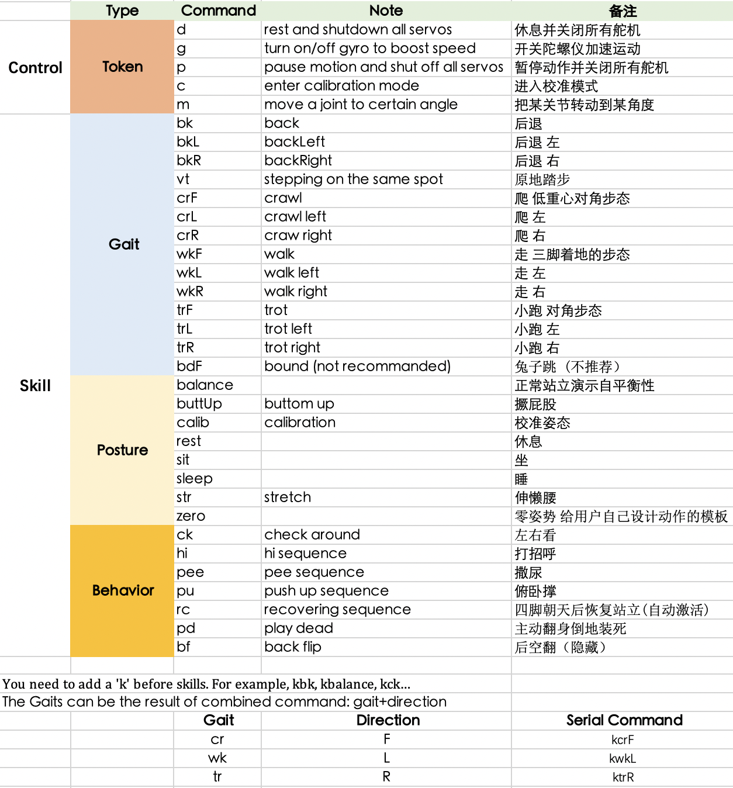

# Robot Dog Bittle - Linefollower
This is a linefollower for the robot dog Bittle. It is based on the [ESP32-CAM](https://www.espressif.com/en/products/hardware/esp32-cam/overview) and uses a linefollower program to detect the line. The ESP32-CAM is connected to the [Bittle](https://www.petoi.com/products/petoi-bittle-robot-dog). 
The bittle is controlled via serial communication. The serial communication is done via the [ESP32-CAM](https://www.espressif.com/en/products/hardware/esp32-cam/overview) and the [Bittle](https://www.petoi.com/products/petoi-bittle-robot-dog).
The linefollower is written in C++. The code is written for the ESP32-CAM.

I will add a slightly more detailed description later.

## Hardware
- [ESP32-CAM](https://www.espressif.com/en/products/hardware/esp32-cam/overview)
- [Bittle](https://www.petoi.com/products/petoi-bittle-robot-dog)

## Software
- [Arduino IDE](https://www.arduino.cc/en/software)
- [OpenCV](https://opencv.org/)
- [Visual Studio Code](https://code.visualstudio.com/)
- [Arduino Extension](https://marketplace.visualstudio.com/items?itemName=vsciot-vscode.vscode-arduino)
- [NodeRed](https://nodered.org/)

## Dependencies for serial communication with node-red
<details>
<summary>Install dependencies on Linux</summary>
<br>
Install Node-Red

Check if Node.js and npm are installed
```
node -v && npm -v
```

If not installed, install Node.js and npm
```
$ sudo apt-get install nodejs && sudo apt-get install npm
```

Install Node-Red
```
$ sudo npm install -g --unsafe-perm node-red
```

Install Node-Red Dashboard
```
$ cd ~/.node-red
$ npm install node-red-dashboard
```

Install Node-Red Node for Bittle
```
$ cd ~/.node-red
$ npm install node-red-contrib-bittle
```

Install Node-Red Serialport
```
$ cd ~/.node-red
$ npm install node-red-node-serialport
```

</details>

<details>
<summary>Install dependencies on Windows</summary>
<br>
Check if Node.js and npm are installed
```
node -v && npm -v
```

If not installed, install Node.js and npm on Windows
```
https://nodejs.org/en/download/
```

Install Node-Red Windows
```	
$ npm install -g --unsafe-perm node-red
```
Install Node-Red Dashboard
```
$ cd %userprofile%\.node-red
$ npm install node-red-dashboard
```

Install Node-Red Node for Bittle
```
$ cd %userprofile%\.node-red
$ npm install node-red-contrib-bittle
```

Install Node-Red Serialport
```
$ cd %userprofile%\.node-red
$ npm install node-red-node-serialport
```


</details>


## Installation
1. [Install the Arduino IDE](https://support.arduino.cc/hc/en-us/articles/360019833020-Download-and-install-Arduino-IDE)
2. [Install the Arduino Extension for Visual Studio Code]
3. Clone this repository
4. Open the folder in Arduino IDE
5. Install the ESP32-CAM Board in the Arduino IDE
6. Go to the nodeRed_variables.h file and change the WIFI ssid and password to your WIFI ssid and password
7. Install the following libraries in the Arduino IDE
    - ArduinoJson
    - WiFi
    - HTTPClient
    - ESPCamera
8. Connect the ESP32-CAM to the computer
9. Select the correct port in the Arduino IDE
10. Select the correct board in the Arduino IDE
    - Board: "AI Thinker ESP32-CAM"
    - Upload Speed: "115200"
    - CPU Frequency: "240MHz (WiFi/BT)"
11. Upload the code to the ESP32-CAM
12. Conect the 3D printed parts to the Bittle
    - Connect the Ultrasonic Sensor Holder to the Camera Holder
    - Connect the Camera Holder to the Bittle
    -Clip the LED-Strip to the Bittle front rail
12. Conect the ESP32-CAM to the Bittle 
    (Caution to not connect the pins wrong to not damage the Bittle or overwirte the firmware)
    - Connect the GND pin of the ESP32-CAM to the GND pin of the Bittle
    - Connect the TX pin of the ESP32-CAM to the RX pin of the Bittle
    - Connect the RX pin of the ESP32-CAM to the TX pin of the Bittle
    - Connect the 5V pin of the ESP32-CAM to the 5V pin of the Bittle
13. Conect the LED-Strip to the ESP32-CAM
    - Connect the GND pin of the ESP32-CAM to the GND pin of the LED-Strip
    - Connect the 5V pin of the ESP32-CAM to the 5V pin of the LED-Strip
    - Connect the D14 pin of the ESP32-CAM to the D pin of the LED-Strip
15. Connect the Ultrasonic Sensor to the ESP32-CAM
    - Connect the GND pin of the ESP32-CAM to the GND pin of the Ultrasonic Sensor
    - Connect the 5V pin of the ESP32-CAM to the 5V pin of the Ultrasonic Sensor
    - Connect the D12 pin of the ESP32-CAM to the Trig pin of the Ultrasonic Sensor
    - Connect the D13 pin of the ESP32-CAM to the Echo pin of the Ultrasonic Sensor
16. Start Node-Red in the terminal
    ```
    node-red
    ```
17. Open the Node-Red flow in the browser
    ```
    http://localhost:1880/
    ```
18. Import the Node-Red flow
    - Click on the hamburger menu in the top right corner
    - Click on import
    - Click on clipboard
    - Copy the content of the nodeRed_flow.json file
    - Paste the content in the import window
    - Click on import
19. Deploy the Node-Red flow
    - Click on the hamburger menu in the top right corner
    - Click on deploy
20. Start the Bittle
21. Go to the Node-Red Dashboard in the browser
    ```
    http://localhost:1880/ui
    ```
22. Set the desired parameters in the Node-Red Dashboard
23. Calibrate using the image server on the ESP#2 ip address
    ```
    http://ip_address_of_the_esp32-cam:81
    ```
24. Start the linefollower using the Node-Red Dashboard


## [Tutorial](<https://i40.fh-aachen.de//courses/dta/activities/bittle/workspace_setup.html#node-red>)

## Tips and tricks
<details>
<summary>Bittle serial cmds</summary>
<br>




</details>


## Printed parts
<details>
<summary>Printed parts</summary>
<br>

ESP_Mount.stl

    Mount for the ESP32-CAM. It is printed in PLA+ and it is holding the ESP32-CAM securely in place while the Bittle is moving.
    Alsos it leaves the back open for connection jumper cables.

Mount_Neck_Connection.stl

    Connection between the Camera Holder and the Ultrasonic Sensor Holder. It is printed in PLA+ and it is holding the Camera Holder and the Ultrasonic Sensor Holder securely in place while the Bittle is moving.
    

UltrasonicSensorHolder.stl
    
        Holder for the Ultrasonic Sensor. It is printed in PLA+ and it is holding the Ultrasonic Sensor securely in place while the Bittle is moving.
        It is screwed to the Camera Holder. With the Mount_Neck_Connection.stl. 

LED_Mount.stl

    Mount for the LED-Strip. It is printed in PLA+ and it is holding the LED-Strip securely in place while the Bittle is moving.
    It is clipped to the Bittle front rail.


standWithCalibration.stl

    Stand for the Bittle. It is printed in PLA+ and it is for testing and calibration without risking the Bittle to fall down.
</details>

## [Official Repository](https://github.com/PetoiCamp)
